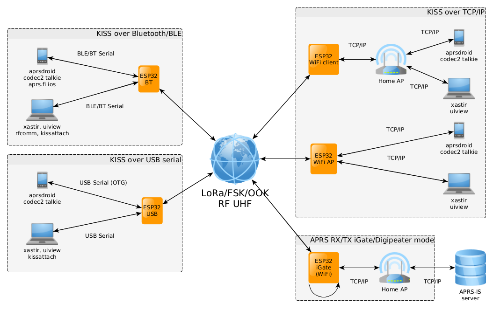

# ESP32 LoRa APRS Modem 

This project is amateur radio ESP32 based LoRa **KISS Bluetooth/BLE/USB/TCPIP** modem + LoRa **APRS-IS RX/TX iGate** server over WiFI + LoRa **APRS digipeater** + **Codec2 DV modem** (with Codec2 Talkie Android application). 

&#x26A0; **To configure sketch modify default parameters in config.h file.**

- For project description, detailed setup and more information, please, visit our Wiki at https://github.com/sh123/esp32_loraprs/wiki
- For discussions, visit https://github.com/sh123/esp32_loraprs/discussions

&#x26A0; Project also supports **APRSDroid TNC2 text APRS packet mode** (configurable), which makes it interoperable with other LoRa APRS trackers without AX25 support.

Supported module types: **SX126X**, **SX127X** and other modules supported by RadioLib.

Modules, which are used by users and known to work
- **SX126X** (**suggested**, 1W modules will provide decent coverage for APRS, stable frequency suitable for < 125 kHz BW at 433 MHz, 5V from USB power bank is enough to power it, has additional LNA)
  - &#128077; **E22-400M30S (SX1268)**
  - E220-400M30S (LLCC68) BW125 SF from 7 to 9 (chip limitations)
- **SX127X** (low power, 50-100mW, temperature frequency drift, problematic for narrow band)
  - RA-01 (SX1278)
  - RA-02 (SX1276)
  - TTGO T-Beam (SX1276)

# Dependencies
Install via libraries:
- Arduino ESP32 library: https://github.com/espressif/arduino-esp32
- LoRa library
  - RadioLib library (&#x26A0;use github master version): https://github.com/jgromes/RadioLib
  - or LoRa Arduino library: https://github.com/sandeepmistry/arduino-LoRa
- Arduino Timer library: https://github.com/contrem/arduino-timer
- CircularBuffer library: https://github.com/rlogiacco/CircularBuffer
- DebugLog library: https://github.com/hideakitai/DebugLog

# Development board
Development board schematics, case and antenna models are available under `cad` and `schematics`.

