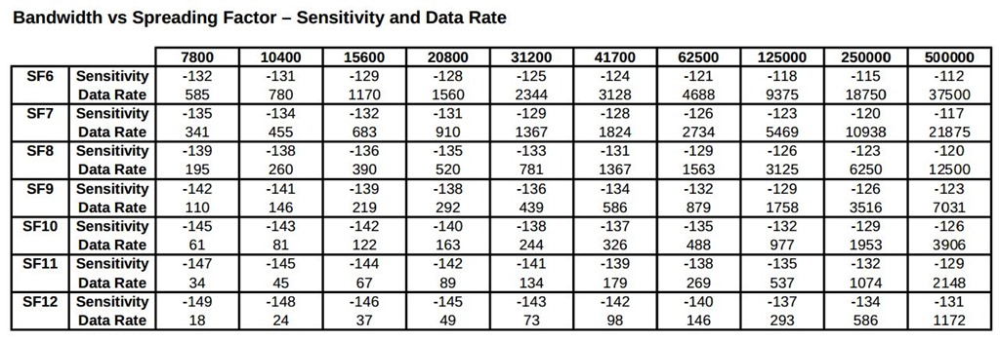
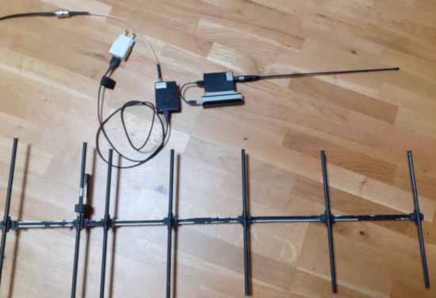

# Table of contents
* [Introduction](#introduction)
* [Compatible Boards](#compatible-boards)
* [Software Dependencies](#software-dependencies)
* [Software Setup](#software-setup)
* [Protocol Compatibility](#protocol-compatibility)
* [Alternative Linux Setup](#alternative-linux-setup)
* [CSMA Usage](#csma-usage)
* [Digital voice with Codec2](#digital-voice-with-codec2)
* [Test Results](#test-results)

# Introduction
Amateur radio ESP32 based LoRa APRSDroid KISS Bluetooth modem + LoRa APRS-IS RX/TX iGate server over WiFI + digipeater + Codec2 DV modem (in conjunction with Android frontend application)

Can be used in several modes: 
- **LoRa APRS KISS client over bluetooth** 
  - you need to use **APRSDroid** application (https://aprsdroid.org), connect to the modem using bluetooth, data will be re-transmitted through the LoRa radio, this is similar to APRSDroid micromodem - https://unsigned.io/micromodem/, received data will be sent back to the APRSDroid using bluetooth. By having two clients you can not only send your position, but also send and receive APRS messages
  - it is also possible to use **other KISS APRS clients** over Bluetooth serial, just use `rfcomm` on Linux to setup serial over Bluetooth and put up AX25 interface with `kissattach`, then use any existing Linux APRS clients, such as `xastir`, see section below for alternative Linux usage
- **LoRa APRS iGate RX/TX server over WiFi + Digipeater**
  - **RF to APRS-IS gating**, it will connect to your WiFI and will forward received APRS positions from RF LoRa into the APRS-IS network, it also reports client signal level, by appending it into the APRS comment, so you can see your signal reports in different locations (could be enabled or disabled from config). This way, it is also possible to setup portable iGate by connecting to your mobile phone's hotspot and provide power from the phone USB port by using OTA cable
  - **APRS-IS to RF gating**, it is possible to enable it together with the filter in the config, so APRS-IS data will be forwarded to RF
  - **RF digirepating** for `WIDEn-n` new style paths
  - **Beaconing**, own station periodic beacon announcement to APRS-IS and RF
- **LoRa Codec2 digital voice communication modem**
  - just install https://github.com/sh123/codec2_talkie on you Android phone, pair with the modem and you can communicate with each other by using digital voice [Codec2](http://www.rowetel.com/?page_id=452)

# Compatible Boards
All work was done on ESP32-WROOM with custom made LoRa shield, if your ESP32 board is compatible then it should work, but there might be need to redefine pinouts to LoRa module if it differs (see further description in Software Setup section), currently pinouts are connected from LoRa to ESP32-WROOM as (SS/RST/DIO0 could be redefined in loraprs_service.h):


- SS: GPIO_5
- RST: GPIO_26
- DIO0: GPIO_14
- MOSI: GPIO_23/VSPI_MOSI
- MISO: GPIO_19/VSPI_MISO
- SCK: GPIO_18/VSPI_SCK

# Software Dependencies
Install via libraries:
- Arduino ESP32 library: https://github.com/espressif/arduino-esp32
- LoRa arduino library: https://github.com/sandeepmistry/arduino-LoRa
- Arduino Timer library: https://github.com/contrem/arduino-timer

# Software Setup
- when setting up APRSDroid, use **"TNC (KISS)"** connection protocol in Connection Preferences -> Connection Protocol
- go to esp32_loraprs.ino and make next changes based on your requirements in `initializeConfig()`
  - set `cfg.IsClientMode` to `false` if you are planning to run server mode for APRS-IS iGate / Digipeater
  - for server mode fill `cfg.WifiSsid` and `cfg.WifiKey` with your WiFI AP data
  - for server mode fill `cfg.AprsLogin` and `cfg.AprsPass` with APRS-IS login callsign and pass
  - for server mode fill `cfg.AprsFilter`, see http://www.aprs-is.net/javAPRSFilter.aspx for various formats, do not include `filter` directive, just space separated values
  - change `cfg.LoraFreq` if you are planning to use different frequency or if planning to calibrate clients, currently it is set to **433.775MHz** as per https://vienna.iaru-r1.org/wp-content/uploads/2019/01/VIE19-C5-015-OEVSV-LORA-APRS-433-MHz.pdf
- if you are planning to use different esp32 pinouts then modify loraprs_service.h
  - lora module SS, **CfgPinSs**, GPIO_5
  - lora module RST, **CfgPinRst**, GPIO_26
  - lora module DIO0, **CfgPinDio0**, GPIO_14
- if you are planning to experiment with different bandwidths/spread factors then modify values in `initializeConfig()`, with current parameters APRS packet time on air is around **1-2 seconds** @ 292bps/36Bps, to decode with as lower level as possible with reasonable speed (comparable to 300bps HF APRS), use https://github.com/tanupoo/lorawan_toa or https://www.rfwireless-world.com/calculators/LoRa-Data-Rate-Calculator.html to make further calculations
  - lora bandwidth `cfg.LoraBw`, 125 kHz (also tested with 20.6 KHz and SF9 with frequency correction)
  - lora spread factor `cfg.LoraSf`, 12 (should decode down to -20dB, choosen with the goal for minimum signal decode)
  - lora coding rate `cfg.LoraCodingRate`, 7
  - lora output power `cfg.LoraPower`, 20 (max 20 dBm ~ 100mW, change to lower value if needed)
  - sync word `cfg.LoraSync`, 0x34
- consider minimum decode level based on on BW + SF and required throughput 
- use 80 MHz ESP32 frequency in Arduino SDK, it will prolong battery life when operating portable, higher CPU speed is not required, there are no CPU intensive operations
- uses LoRa **built-in checksum** calculation to drop broken packets
- note, that there a is **significant frequency drift** on temperature changes for different modules
  - you need to use **external TCXO** if you are planning to use modules for narrow bandwidths less than 125 kHz 
  - or calibrate clients based on server frequency drift report by changing `cfg.LoraFreq`, for example, let client and server run for an 30-60 minutes and if server reports err: -1500, then set client frequency to about 1000 kHz less, e.g. instead of 433.775 set it to 433.774, this will give couple of additional dB
  - alternatively automatic calibration could be done on server or client side by enabling automatic frequency correction by setting `cfg.EnableAutoFreqCorrection` to `true`, might be suitable for experiments where only one client is operating or if server broadcast messages, so clients can correct their frequency. Use it either on client side to tune all clients to server frequency if TX is enabled on iGate side or to tune server to single client for test purposes
 - other useful options are
   - `cfg.EnableSignalReport` set to `true` to enable signal report, it will be added as a comment to APRS-IS submitted location
   - `cfg.EnablePersistentAprsConnection` set to `false` to avoid keeping connection open to APRS-IS
   - `cfg.EnableRfToIs` set to `true` to forward RF traffic to APRS-IS
   - `cfg.EnableIsToRf` set to `true` to forward APRS-IS traffic to RF, see also `cfg.AprsFilter` for traffic filtering
   - `cfg.EnableRepeater` set to `true` to enable packet repeater
   - `cfg.EnableBeacon` set to `true` to enable periodic beacons specified in `cfg.AprsRawBeacon` with period specified in `cfg.AprsRawBeaconPeriodMinutes` into RF and APRS-IS if `cfg.EnableRfToIs` is enabled

# Protocol Compatibility
This project is using classical `AX25` frames over LoRa (as defined in http://www.aprs.org/doc/APRS101.PDF page 12) with given LoRa parameters above and `AX25` frames are encapsulated into `KISS` frames when transferred over serial Bluetooth to phone or PC. It should enable interoperability with classical Linux APRS software and `kissattach`. Some LoRa ARPS implementations transfer plain text APRS messages over LoRa, as a result interoperability with this project is not guaranteed.

# Alternative Linux Setup
It is possible to use modem **in client mode** with other generic Linux ax25/aprs tools, such as `xastir`, use next procedure to set it up:
- AX25 howto: http://tldp.org/HOWTO/AX25-HOWTO/
- Install required tools: ```sudo apt-get install ax25-tools ax25-apps xastir bluez bluez-tools```
- Run bluetoothctl and pair with the modem: 
  ```
  # bluetoothctl
  [bluetooth]# agent on
  [bluetooth]# default-agent
  [NEW] Device 01:02:03:04:05:06 loraprs
  [bluetooth]# pair 01:02:03:04:05:06
  Attempting to pair with 01:02:03:04:05:06
  Pairing successful
  [bluetooth]# exit
  ```
- Run `rfcomm` to setup serial over Bluetooth at `/dev/rfcomm0`: `sudo rfcomm bind 0 01:02:03:04:05:06`
- At this stage you can already start using `xastir` or any other application, which can operate over KISS Serial TNC
- You can setup `AX25` network interface with `sudo kissattach /dev/rfcomm0 ax25` command, but previously need to update `/etc/ax25/axports` with new line as `ax25    CALLSIGN-10        9600    255     1       comment`, you can also specify IP address if there is a need to run TCP/IP over AX25
- Run `axlisten` to capture incoming and outgoing traffic as `sudo axlisten -a`
- Use `beacon` utility to send custom packet as 
  ```
  # sudo beacon -s -c NOCALL-7 -d "BEACON WIDE3-3" ax25 "beacon over lora"
  # sudo beacon -s -c NOCALL-7 -d "CQ WIDE1-1 WIDE2-1" ax25 "anyone on lora?"
  # sudo beacon -s -c NOCALL-7 -d "APZMDM WIDE1-1" ax25 "!0000.00N/00000.00E#test position report"
  ```
- Connect to another client as `sudo axcall -s NOCALL-1 ax25 NOCALL-10`

# CSMA Usage
- LoRa library, which is in use by this project does not implement CAD, but CSMAp is utilized by this project as per KISS specification. TX path is executed only when there is no incoming data returned by `LoRa::parsePacket` and TX path is executed with probability p (CSMA persistence), configured by const `Loraprs::Service::CfgCsmaPersistence` in `loraprs_service.h`. Random value is selected between 0 and 255 and TX is executed only when it is lower than `CfgCsmaProbBoundary`. 
- To decrease TX probability in case of high traffic use lower value. `Loraprs::ServiceCsmaSlotTimeMs` configures the amount of time in milliseconds to wait if transmission was not performed due to persistence, select lower value for lower TOA (time on air). It is also possible to dynamically override these parameters with KISS P 0x02 and SlotTime 0x03 command codes from the client.

# Digital voice with Codec2
- This modem could be used in conjuction with [Android Codec2 Walkie-Talkie](https://github.com/sh123/codec2_talkie), when application connects to the modem, instead of sending AX25 APRS packets it sends Codec2 speech encoded frames. This enables digital voice communicaiton between one or multiple modems. 
- Select appropriate lora spread factor `cfg.LoraSf` and bandwidth `cfg.LoraBw` depending on Codec2 speech rate from 450-3200 bps. For example, if you are using 450 bps mode and 20 kHz bandwidth then set spreading factor to 6 or 7. See data rate table above. Note, that LoRa data rate must be at least 170% of codec bit rate to get speech stream without gaps.
- When using modem for voice communication  `Loraprs::Service::CfgCsmaPersistence` must be set to maximum 255 value to disable CSMA, otherwise real time voice communication won't be guaranteed. Android codec2_talkie application automatically sets this parameter to 255 by using KISS P command code.
- Also, it might be useful to disable CRC check for LoRa packets with `cfg.LoraEnableCrc` parameter equal to `false`. Some broken bits in one speech frame will cause audio being scrambled, it might be better then longer gap when complete packet is dropped.

# Test Results

- Antennas
  - Client: rubber duck, halo, mobile antenna on a car roof
  - Server: 7 element UHF yagi indoors, vertical on the roof
  - With such low power it is very important to have antenna SWR close to 1, many rubber duck antennas are claimed to be 433MHz, but they do not resonate at that frequency at all or resonate only when attached to its native large handheld transceiver, which has enough metal inside to behave as a counterpoise, these antennas have SWR 2 or higher. Check your antenna on antenna analyzer before using, add wire counterpoise if needed or better to use dipole or halo home made antenna for that matter
- Range (20 KHz channel width and 9 spreading factor, also got similar results with 125 kHz and 12 SF), it will mostly depend on your base station's antenna elevation
  - **About 7 km** when server is 30m above the ground and client is 2m above the ground with rubber duck antenna or inside a car
  - **About 13 km** when server is 30m above the ground and client is at some higher point ~40m above the ground with rubber duck antenna
  - **About 17km** maximum (non-reliable) between base and mobile station with antenna on the car roof
  - **About 20km** over the sea between base and handheld
- Signal levels
  - Successful decodes down to **-19.75dB** below the noise floor when using compressed APRS coordinates (smaller packets, about 50 bytes, **32 bytes without PATH, speed, altitude**), see APRSDroid discussions on compressed corrdinates support and custom branches
    - https://github.com/ge0rg/aprsdroid/pull/159
    - https://github.com/ge0rg/aprsdroid/issues/170
    - https://github.com/sh123/aprsdroid/tree/aprsdroid_compressed
    - https://github.com/sh123/aprsdroid/tree/aprsdroid_compressed_gradle
- Polarization
  - Using **horizontal polarization** improves successful decoding probability and receiving range
- Interference
  - Monitor your planned frequency, such as 433.775 MHz for ISM device activity, if there is strong interference from other users tune up or down it to minimize interference, it might be critical for long range
- Weather
  - Rain and high humidity levels decrease signal level by about **~3-6 dB**
- Could not get modems communicate with each other when using spreading factor 6
- It might be useful to add additional pass band filter or broadcast FM radio reject filter, it seem to improve sensitivity when using external base antenna

