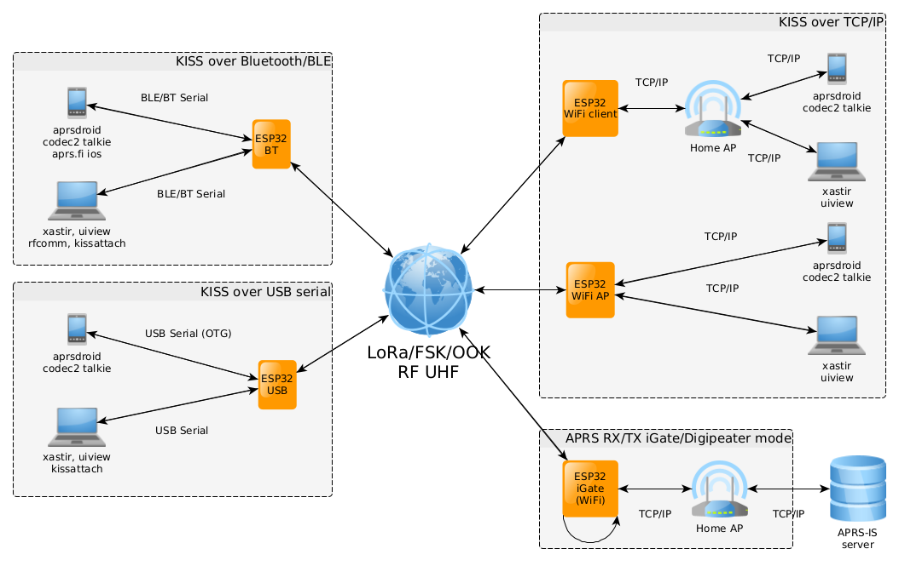
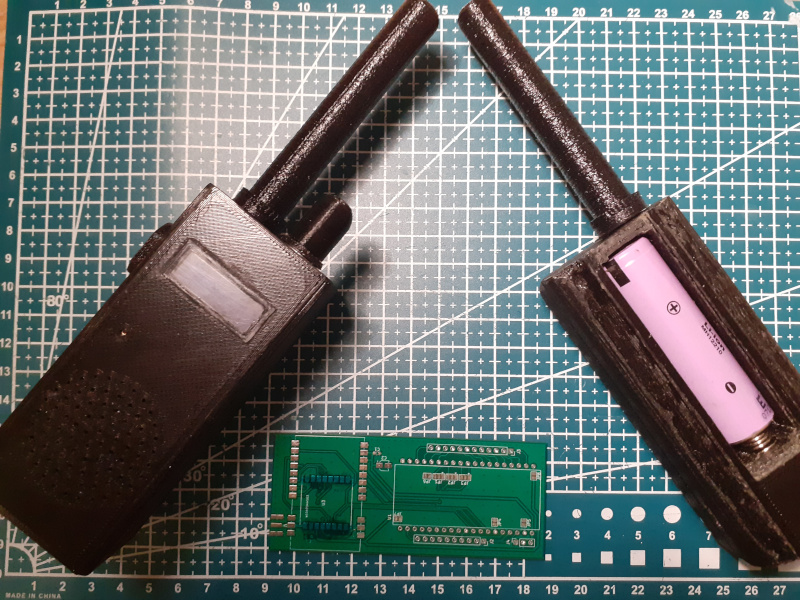

# ESP32 LoRa APRS Modem 

This project is amateur radio ESP32 based LoRa/FSK **KISS Bluetooth/BLE/USB/TCPIP** modem + LoRa **APRS-IS RX/TX iGate** server over WiFI + LoRa/FSK **APRS digipeater** + **Codec2 DV modem** (with Codec2 Talkie Android application). 

&#x26A0; **To configure sketch modify default parameters in config.h file.**

- For project description, detailed setup and more information, please, visit our Wiki at https://github.com/sh123/esp32_loraprs/wiki
- For discussions, visit https://github.com/sh123/esp32_loraprs/discussions

&#x26A0; Project also supports **APRSDroid TNC2 text APRS packet mode** (configurable), which makes it interoperable with other LoRa APRS trackers without AX25 support.

Supported module types: **SX126X**, **SX127X** and other modules supported by RadioLib.

Modules, which are used by users and known to work
- **SX126X** (**suggested**, 1W modules will provide decent coverage for APRS, stable frequency suitable for < 125 kHz BW at 433 MHz, 5V from USB power bank is enough to power it, has additional LNA)
  - &#128077; **E22-400M30S (SX1268)**
  - E220-400M30S (LLCC68) BW125 SF from 7 to 9 (chip limitations)
  - These modules are 30dbm modules, but maximum power should be set to no more than 20-22dbm, see https://github.com/jgromes/RadioLib/wiki/High-power-Radio-Modules-Guide
- **SX127X** (low power, 50-100mW, temperature frequency drift, problematic for narrow band)
  - RA-01 (SX1278)
  - RA-02 (SX1276)
  - TTGO T-Beam (SX1276)

# Building
- Update `include/config.h` with your radio settings
  - If you are using lora-aprs iGate (non AX.25) then set `CFG_TEXT_PACKETS` and `CFG_TEXT_PACKETS_3` config parameters to `true` and use APRSDroid TNC2 connection protocol
- To build for client/tracker mode use `pio run -e esp32dev`
- To build for iGate mode use `pio run -e esp32dev_igate`

# Development board
Development board schematics, case and antenna models are available under `extras/cad` and `extras/schematics`. 

Supported ESP32 boards are with 36 and 38 pinouts (configured with solder pads).

&#x26A0; **There are ESP32 boards with different socket widths: 22mm and 25mm, board files for 25mm have _wide suffix in file names.**

