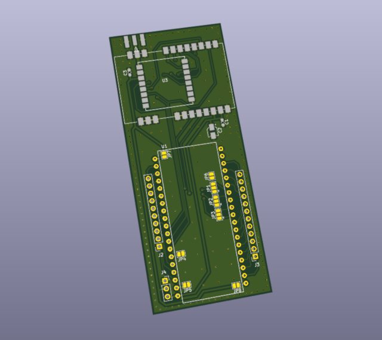

# ESP32 LoRa modem devboard

This is small universal ESP32 devkit LoRa prototyping board for RA-01 or E22-400M30S modules on the same board. 

Suitable for two different narrower ESP32 devkit board types with different pinouts (38 pins and 36 pins). 

Pinout configuration is done via solder pads.

&#x26A0; **There are ESP32 boards with different socket widths: 22mm and 25mm, board files for 25mm have _wide suffix in file names.**

